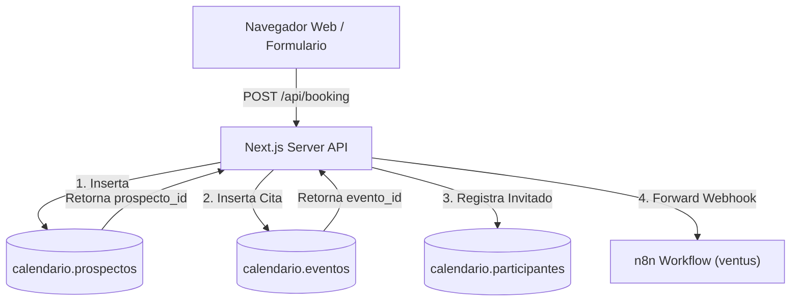

# Documentación Técnica — Arquitectura del Sistema de Calendario Nativo en Supabase Auto-Hospedado

## 📋 1. Introducción y Objetivos Arquitectónicos

El sistema de calendario nativo de **SmartContacts** permite gestionar eventos, prospectos comercialmente interesados, zonas horarias, participantes y excepciones de recurrencia directamente sobre la base de datos PostgreSQL de Supabase.

A diferencia de depender de APIs comerciales de terceros (Google Calendar, Outlook Graph API), todo el procesamiento se ejecuta con alto rendimiento, **soberanía total de datos** y coste cero por llamadas de API externas.

---

## 🏛️ 2. Cumplimiento de Reglas del Proyecto (`AGENTS.md`)

De acuerdo con las normativas estrictas del proyecto:

1. **Regla 5 (`schema.nombre_de_tabla`)**:
   Todas las tablas pertenecen de forma estricta al esquema PostgreSQL **`calendario`**:
   - `calendario.prospectos`
   - `calendario.calendarios`
   - `calendario.permisos`
   - `calendario.eventos`
   - `calendario.participantes`
   - `calendario.excepciones`

2. **Regla 4 (Idioma Español Estricto)**:
   Todas las entidades, columnas y valores de tipos enumerados (`AS ENUM`) se encuentran en idioma español (`'pendiente'`, `'confirmado'`, `'propietario'`, `'observador'`).

3. **Regla 6 (Zero Hardcoded Secrets)**:
   Todas las conexiones consumen variables de entorno registradas en `.env.example`.

---

## 🗄️ 3. Modelo de Datos Relacional (Esquema DDL SQL)

```sql
-- 1. Asegurar Esquema Obligatorio
CREATE SCHEMA IF NOT EXISTS calendario;

-- 2. Tipos Enumerados en Español
CREATE TYPE calendario.rol_permiso AS ENUM ('propietario', 'editor', 'observador');
CREATE TYPE calendario.estado_participante AS ENUM ('pendiente', 'confirmado', 'rechazado', 'tentativo');
CREATE TYPE calendario.visibilidad_evento AS ENUM ('publico', 'privado', 'confidencial');

-- 3. Tabla de Prospectos (Registro Comercial de Interesados)
CREATE TABLE IF NOT EXISTS calendario.prospectos (
  id UUID PRIMARY KEY DEFAULT gen_random_uuid(),
  created_at TIMESTAMPTZ NOT NULL DEFAULT timezone('utc'::text, now()),
  name TEXT NOT NULL,
  phone TEXT NOT NULL,
  email TEXT NOT NULL,
  company TEXT,
  is_company BOOLEAN DEFAULT true,
  service TEXT,
  topic TEXT,
  description TEXT,
  status TEXT NOT NULL DEFAULT 'pendiente'
);

-- 4. Tabla de Calendarios (Personales, Trabajo, Proyectos)
CREATE TABLE IF NOT EXISTS calendario.calendarios (
    id UUID PRIMARY KEY DEFAULT gen_random_uuid(),
    propietario_id UUID REFERENCES auth.users(id) ON DELETE CASCADE,
    nombre TEXT NOT NULL,
    descripcion TEXT,
    color TEXT NOT NULL DEFAULT '#3B82F6',
    zona_horaria TEXT NOT NULL DEFAULT 'America/Bogota',
    es_principal BOOLEAN NOT NULL DEFAULT FALSE,
    creado_en TIMESTAMPTZ NOT NULL DEFAULT NOW(),
    actualizado_en TIMESTAMPTZ NOT NULL DEFAULT NOW()
);

-- 5. Tabla de Permisos y Compartición
CREATE TABLE IF NOT EXISTS calendario.permisos (
    id UUID PRIMARY KEY DEFAULT gen_random_uuid(),
    calendario_id UUID NOT NULL REFERENCES calendario.calendarios(id) ON DELETE CASCADE,
    usuario_id UUID NOT NULL REFERENCES auth.users(id) ON DELETE CASCADE,
    rol calendario.rol_permiso NOT NULL DEFAULT 'observador',
    creado_en TIMESTAMPTZ NOT NULL DEFAULT NOW(),
    CONSTRAINT unico_calendario_usuario UNIQUE (calendario_id, usuario_id)
);

-- 6. Tabla Principal de Eventos y Citas
CREATE TABLE IF NOT EXISTS calendario.eventos (
    id UUID PRIMARY KEY DEFAULT gen_random_uuid(),
    calendario_id UUID REFERENCES calendario.calendarios(id) ON DELETE CASCADE,
    creador_id UUID REFERENCES auth.users(id) ON DELETE SET NULL,
    prospecto_id UUID REFERENCES calendario.prospectos(id) ON DELETE SET NULL,
    titulo TEXT NOT NULL,
    descripcion TEXT,
    ubicacion TEXT,
    inicio TIMESTAMPTZ NOT NULL,
    fin TIMESTAMPTZ NOT NULL,
    todo_el_dia BOOLEAN NOT NULL DEFAULT FALSE,
    zona_horaria TEXT NOT NULL DEFAULT 'America/Bogota',
    visibilidad calendario.visibilidad_evento NOT NULL DEFAULT 'publico',
    rrule TEXT, -- Formato RFC 5545 iCalendar
    recurrencia_id TIMESTAMPTZ,
    metadata JSONB DEFAULT '{}'::jsonb,
    creado_en TIMESTAMPTZ NOT NULL DEFAULT NOW(),
    actualizado_en TIMESTAMPTZ NOT NULL DEFAULT NOW(),
    CONSTRAINT orden_fechas_valido CHECK (fin >= inicio)
);

-- 7. Tabla de Participantes e Invitados
CREATE TABLE IF NOT EXISTS calendario.participantes (
    id UUID PRIMARY KEY DEFAULT gen_random_uuid(),
    evento_id UUID NOT NULL REFERENCES calendario.eventos(id) ON DELETE CASCADE,
    usuario_id UUID REFERENCES auth.users(id) ON DELETE CASCADE,
    email TEXT NOT NULL,
    estado calendario.estado_participante NOT NULL DEFAULT 'pendiente',
    creado_en TIMESTAMPTZ NOT NULL DEFAULT NOW(),
    CONSTRAINT unico_evento_participante UNIQUE (evento_id, email)
);

-- 8. Tabla de Excepciones para Eventos Recurrentes
CREATE TABLE IF NOT EXISTS calendario.excepciones (
    id UUID PRIMARY KEY DEFAULT gen_random_uuid(),
    evento_padre_id UUID NOT NULL REFERENCES calendario.eventos(id) ON DELETE CASCADE,
    fecha_excepcion DATE NOT NULL,
    esta_cancelado BOOLEAN NOT NULL DEFAULT FALSE,
    nuevo_inicio TIMESTAMPTZ,
    nuevo_fin TIMESTAMPTZ,
    titulo TEXT,
    descripcion TEXT,
    creado_en TIMESTAMPTZ NOT NULL DEFAULT NOW(),
    CONSTRAINT unica_excepcion_fecha UNIQUE (evento_padre_id, fecha_excepcion)
);
```

---

## ⚡ 4. Funciones Almacenadas en PL/pgSQL

### Función de Consulta Optimizada por Rango de Fechas:

```sql
CREATE OR REPLACE FUNCTION calendario.obtener_eventos_rango(
    p_inicio TIMESTAMPTZ,
    p_fin TIMESTAMPTZ
)
RETURNS SETOF calendario.eventos AS $$
BEGIN
    RETURN QUERY
    SELECT e.*
    FROM calendario.eventos e
    WHERE e.inicio <= p_fin
      AND e.fin >= p_inicio
    ORDER BY e.inicio ASC;
END;
$$ LANGUAGE plpgsql SECURITY DEFINER;
```

---

## 🔗 5. Flujo de Integración Comercial Automático (`/api/booking`)

Cuando un usuario llena el formulario de contacto o agendamiento en el sitio web:


